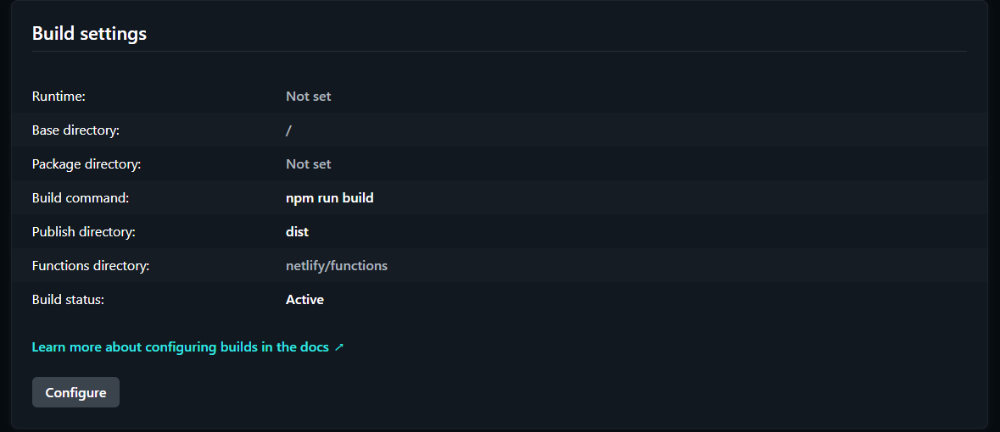

# Documentație pentru Aplicația de Abonamente

## Descriere
Această aplicație este construită folosind **Next.js**, un framework React pentru dezvoltarea de aplicații web. Permite utilizatorilor să vizualizeze și să gestioneze abonamentele. Interfața este construită cu ajutorul componentelor React și este stilizată folosind Tailwind CSS.

## Cerințe
Pentru a rula aplicația, asigurați-vă că aveți instalate următoarele:

- [Node.js](https://nodejs.org/) (versiunea 14 sau mai recentă)
- [npm](https://www.npmjs.com/) (inclus cu Node.js)

## Instalare

1. **Clonați repository-ul:**
   ```bash
   git clone https://github.com/Leonard-71/frontend-parking.git
   cd frontend-parking
   ```

2. **Instalați dependențele:**
   ```bash
   npm install
   ```

## Rulare

Pentru a porni aplicația în modul de dezvoltare, utilizați comanda:

```bash
npm run dev
```

Aplicația va fi disponibilă la [http://localhost:3000](http://localhost:3000).

## Structura Proiectului

- `src/`
  - `components/` - Componentele reutilizabile ale aplicației.
  - `hooks/` - Hook-uri personalizate pentru gestionarea stării.
  - `pages/` - Pagini principale ale aplicației.
  - `interface/`  - Destinat pentru definirea și organizarea tipurilor și interfețelor TypeScript utilizate.
  - `hooks/` - Conține hook-uri personalizate care gestionează logica pentru conectarea și comunicarea cu backendul.
  - `translation/` - Conține fișiere cu textul utilizat în aplicație, structurat pentru a permite localizarea și traducerea în diverse limbi.
  - `constants/` - Constante utilizate în aplicație.

## Librării și Tool-uri Utilizate

- **Vite** - Framework pentru dezvoltarea rapidă a aplicațiilor web.
- **React** - Biblioteca principală pentru construirea interfeței utilizator.
- **TypeScript** - Limbaj de programare care extinde JavaScript cu tipuri statice.
- **Tailwind CSS** - Framework CSS pentru stilizarea rapidă a componentelor.
- **Axios** - Pentru efectuarea cererilor HTTP (dacă este cazul).

## Contribuții

Dacă doriți să contribuiți la acest proiect, urmați acești pași:

1. Fork-uiți repository-ul.
2. Creați o ramură nouă (`git checkout -b feature-numele-feature-ului`).
3. Faceți modificările dorite și adăugați-le (`git add .`).
4. Comiteți modificările (`git commit -m 'Adăugat o nouă caracteristică'`).
5. Împingeți ramura (`git push origin feature-numele-feature-ului`).
6. Deschideți un **Pull Request**.


## Configurarea Netlify

   Va trebui să creați un cont pe [Netlify](https://www.netlify.com/).

# Crează un nou proiect:

   1. Apasă pe **Add new site** > **Import an existing project**.
   2. Alege repository-ul GitHub.
   3. Configurează setările de build:
      -branch: De regulă, main sau master.
      -Build command: npm run build
      -Publish directory: dist
       
   4. Adăugarea fișierului netlify.toml (în rădăcina proiectului)
   
 
 # Deploy-ul aplicației

   1. Apasă **Deploy site** pe Netlify (după terminarea procesului de build, se va genera un URL al aplicației).

# Debugging și optimizări

   1. **Erori de 404**: fișierul netlify.toml poate contine erori cu privire la redirecționări.
   2. **Actualizări**: la fiecare commit în branch-ul configurat, Netlify va rula automat un nou build și va actualiza aplicația.


## Licență

Acest proiect este licențiat sub Licența MIT. Vă rugăm să consultați fișierul `LICENSE` pentru detalii.

## Contact

Pentru întrebări sau sugestii, vă rugăm să ne contactați la [leonard@email.com](mailtofilip:filipleonard71@yahoo.com).